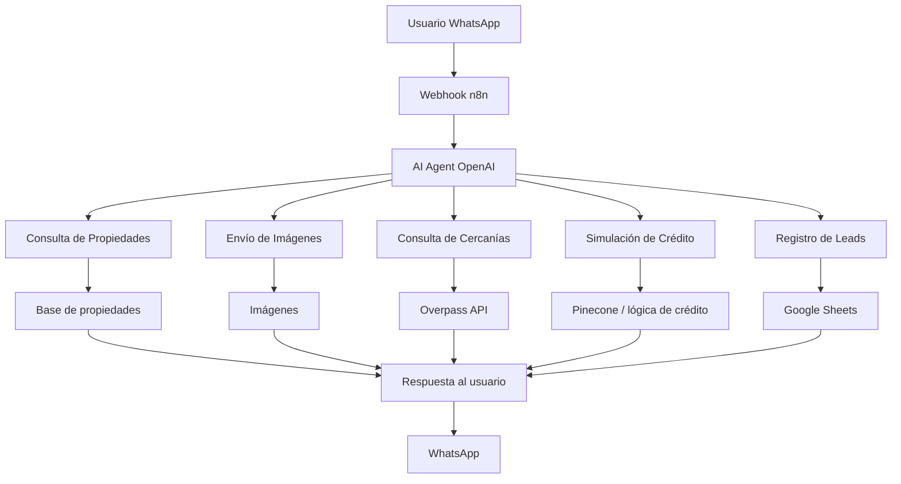

# Angente-Inmobiliario-G7
Proyecto académico de agente inmobiliario automatizado con n8n
# Trabajo Final – Agente Inmobiliario Automatizado con IA

## Objetivo

Desarrollar un agente inmobiliario automatizado en n8n capaz de responder consultas por WhatsApp, sugerir propiedades, enviar imágenes, mostrar puntos de interés cercanos, realizar una simulación básica de crédito y registrar leads comerciales.

## Descripción del proyecto

Este proyecto implementa un flujo automatizado con n8n que recibe mensajes desde WhatsApp, interpreta la intención del usuario mediante un agente conectado a OpenAI y ejecuta subworkflows especializados según la necesidad de la consulta.

## Funcionalidades principales

- Atención automática de consultas
- Sugerencia de propiedades
- Envío de imágenes de propiedades
- Información de cercanías
- Simulación básica de crédito
- Registro de leads comerciales

## Arquitectura del sistema

## Flujo general

1. El usuario envía un mensaje por WhatsApp.
2. El webhook recibe el mensaje en n8n.
3. El agente interpreta la intención.
4. Se activa el subworkflow correspondiente.
5. Se consulta la base de datos o APIs externas.
6. Se genera la respuesta.
7. La respuesta vuelve al usuario por WhatsApp.

## Tecnologías utilizadas

- n8n
- OpenAI
- Evolution API
- Google Sheets
- Pinecone
- Overpass API

## Subworkflows del proyecto

### 1. Consulta de propiedades
Busca propiedades y devuelve información relevante como precio, características y descripción.

### 2. Envío de imágenes
Recupera y envía múltiples imágenes de una propiedad.

### 3. Consulta de cercanías
Obtiene puntos de interés cercanos a la ubicación de la propiedad.

### 4. Simulación de crédito
Hace preguntas al usuario y estima la viabilidad de financiamiento.

### 5. Registro de leads
Guarda nombre y teléfono del cliente interesado para seguimiento comercial.

## Manejo de datos

El proyecto utiliza nodos de transformación, expresiones y mapeo de datos dentro de n8n para estructurar la información antes de responder al usuario o llamar subworkflows.

## Integraciones externas

- WhatsApp vía Evolution API
- OpenAI para interpretación conversacional
- Google Sheets para leads
- Pinecone para recuperación contextual
- Overpass API para ubicaciones y cercanías

## Seguridad y credenciales

Las credenciales se gestionan desde n8n para evitar exponer claves directamente en el workflow.

## Ejemplo de conversación

**Usuario:** Busco una casa económica.  
**Agente:** Tengo estas opciones disponibles. ¿Prefieres una casa o departamento?  
**Usuario:** Casa.  
**Agente:** Encontré una opción interesante. Te comparto precio, imágenes y datos de la zona.

## Conclusión

Este proyecto demuestra cómo combinar agentes de IA y automatización con n8n para resolver un caso real del sector inmobiliario y mejorar la atención comercial.
